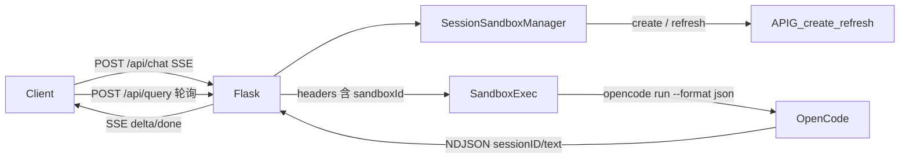

# 项目技术方案

Flask 代理服务：按业务 `session_id` 拉起/复用第三方沙箱，在沙箱内执行 OpenCode，对外提供 **SSE 流式多轮对话** 与 **异步任务轮询**。

对外 HTTP 约定见 [API.md](API.md)。

## 1. 目标与边界

| 目标 | 做法 |
|------|------|
| 沙箱按会话复用 | 同一 `session_id` 绑定同一 `sandboxId` |
| 沙箱保活 | 默认 TTL 900s；仅当该沙箱有执行中任务且即将到期时 refresh |
| 多轮对话 | 缓存 OpenCode `sessionID`，后续 `opencode run --session` |
| 流式输出 | OpenCode `--format json` → 解析 NDJSON → SSE `delta/done/error` |
| 网关鉴权可配置 | APIG 与 SDK 共用 `X-HW-ID` / `X-HW-APPKEY`；SDK 另带 `x-livefunction-sandbox-id` |

**不在范围内：** 会话持久化（Redis/DB）、多 gunicorn worker 共享状态、沙箱销毁接口、WebSocket。

进程内状态（任务、session 映射）随进程重启丢失；生产须 `gunicorn -w 1`。

## 2. 系统架构

分两层网关：

- **管理面（APIG）**：创建实例、刷新 TTL。地址 `SANDBOX_APIG_ENDPOINT`。
- **运行面（agent-sandbox）**：在已创建实例里执行 shell。地址 `SANDBOX_BASE_URL`，用 header 路由到具体实例，URL 不内嵌 sandboxId。

本地调试可设 `SANDBOX_DOCKER_CONTAINER`，跳过 APIG，改为 `docker exec`。



## 3. 模块与文件

```
run.py                     入口
app/
  __init__.py              create_app：TaskStore + TaskWorker
  config.py                环境变量
  routes.py                HTTP：/health /api/chat /api/query /api/tasks
  models.py                异步任务内存存储
  worker.py                线程池消费 /api/query
  session_sandbox.py       session_id → sandboxId + opencode_session_id
  sandbox_lifecycle.py     APIG create / refresh / wait
  sandbox_client.py        组命令、流式拉 stdout、解析 OpenCode 事件
```

| 模块 | 职责 |
|------|------|
| `routes` | 入参校验、SSE 封装、任务提交 |
| `session_sandbox` | 会话级沙箱生命周期入口 `ensure_sandbox` |
| `sandbox_lifecycle` | 只对接 APIG HTTP |
| `sandbox_client` | 对接运行面 + OpenCode CLI |
| `worker` + `models` | 非流式路径：排队 → `run_opencode` → 落库内存 |

## 4. 主流程

### 4.1 SSE 对话（推荐）

1. `POST /api/chat` 校验 `session_id`、`query`
2. `stream_opencode` → `ensure_sandbox(session_id)`（标记 `active_count+1`，结束时 `-1`）
   - 无绑定或已过期：APIG create，starting 时短等（不 refresh）
   - 有绑定且未过期：直接复用
   - 后台线程：`active_count>0` 且剩余 TTL ≤ 120s 才 refresh
3. 组装 `opencode run --format json [-m model] [--session oc_id] query`
4. 运行面拉 stdout（优先 SSE，失败则 async+view 轮询；docker 则 Popen）
5. 解析 JSON 行：抽出 `sessionID` 写回 manager；`text` 转增量 `delta`
6. Flask 把事件写成 `data: {...}\n\n`

### 4.2 异步轮询

`POST /api/query` 写入 `TaskStore` 并 `202`；`TaskWorker` 调同一套 `run_opencode`（内部消费 `stream_opencode`，只取最终 `answer`）。`GET /api/tasks/<id>` 读内存任务。

### 4.3 两种 Session ID

| ID | 谁产生 | 作用 |
|----|--------|------|
| 业务 `session_id` | 客户端 | 绑定沙箱 + 多轮 |
| OpenCode `sessionID`（如 `ses_...`） | OpenCode JSON 事件 | `--session` 续聊 |

二者不要混用。OpenCode ID 不对客户端暴露（SSE 的 `session` 事件只在服务端消费，不转发）。

## 5. 配置分层

**管理面：** `SANDBOX_APIG_ENDPOINT`、`SANDBOX_APIG_HW_ID`、`SANDBOX_APIG_HW_APPKEY`、`SANDBOX_TEMPLATE_ID`、`SANDBOX_INSTANCE_TIMEOUT`、`SANDBOX_REFRESH_DURATION`

**运行面：** `SANDBOX_BASE_URL`；请求头：

| Header | 来源 |
|--------|------|
| `X-HW-ID` / `X-HW-APPKEY` | 上表配置 |
| `x-livefunction-sandbox-id` | 当前会话的 `sandboxId` |
| `X-AIO-API-Key` / `Authorization` | 可选 `SANDBOX_API_KEY` |

**执行：** `OPENCODE_MODEL`、`OPENCODE_TIMEOUT_SECONDS`

**本地：** 设置 `SANDBOX_DOCKER_CONTAINER` 后不调 APIG，`sandbox_id` 用合成值 `docker:{session_id}`。

## 6. 关键节点代码

### 6.1 启动与进程内状态

```13:29:app/__init__.py
def create_app() -> Flask:
    # ...
    store = TaskStore()
    worker = TaskWorker(store)
    app.extensions["task_store"] = store
    app.extensions["task_worker"] = worker
    app.register_blueprint(api_bp)
    return app
```

任务队列和 session 映射都活在**当前进程**。`SessionSandboxManager` 是模块级单例（`session_sandbox.py` 末尾），与 Flask extension 同寿命。

### 6.2 SSE 出口：边执行边推

```45:67:app/routes.py
@api_bp.post("/api/chat")
def chat():
    # ...
    def generate():
        for event in stream_opencode(query, session_id=session_id):
            yield f"data: {json.dumps(event, ensure_ascii=False)}\n\n"

    return Response(
        stream_with_context(generate()),
        mimetype="text/event-stream",
        headers={
            "Cache-Control": "no-cache",
            "X-Accel-Buffering": "no",
            "Connection": "keep-alive",
        },
    )
```

`stream_with_context` 保证生成器在请求上下文里跑。`X-Accel-Buffering: no` 避免前置代理把 SSE 攒成一块再吐。对外只发 `delta` / `done` / `error`（内部 `session` 事件在 `stream_opencode` 里被吃掉）。

### 6.3 按 session 拿沙箱（过期重建，忙时续期）

`ensure_sandbox` **不再每次 refresh**。本地记录 `expires_at`（创建 TTL 默认 900s）：

- 未过期：直接复用
- 已过期 / 无绑定：`create_and_wait` 新建（OpenCode 会话丢失）

执行期间 `stream_opencode` 用 `begin_task` / `end_task` 维护 `active_count`。后台线程每隔 `SANDBOX_KEEPALIVE_INTERVAL_SECONDS` 扫描：

```
有执行中任务（active_count > 0）且 剩余 TTL ≤ SANDBOX_KEEPALIVE_MARGIN_SECONDS
→ refresh(duration=SANDBOX_REFRESH_DURATION，默认 900，硬上限 1800)
→ 更新 expires_at
```

空闲沙箱不续期，到点销毁；暂不处理「能否无限 refresh」的问题。

`starting` 时只短睡等待，**不用 refresh 探活**。`stopped` / `error` 直接失败。

### 6.4 运行面 Header：靠 sandboxId 路由

```33:53:app/sandbox_client.py
def _build_runtime_headers(sandbox_id: Optional[str] = None) -> dict[str, str]:
    headers["X-HW-ID"] = Config.SANDBOX_APIG_HW_ID
    headers["X-HW-APPKEY"] = Config.SANDBOX_APIG_HW_APPKEY
    if sandbox_id and not sandbox_id.startswith("docker:"):
        headers["x-livefunction-sandbox-id"] = sandbox_id
    # 可选 SANDBOX_API_KEY → X-AIO-API-Key + Bearer
```

`base_url` 固定为 `SANDBOX_BASE_URL`。网关根据 `x-livefunction-sandbox-id` 把 `/v1/shell/exec` 打到对应实例。docker 合成 id 不写这个 header。

### 6.5 OpenCode 命令：JSON 流 + 续聊

```56:70:app/sandbox_client.py
def _build_opencode_command(query: str, *, opencode_session_id: Optional[str] = None) -> str:
    # opencode run --dangerously-skip-permissions --format json
    #            [--session ses_xxx] -m <model> '<query>'
```

- `--format json`：stdout 一行一个事件，带 `sessionID`、`type=text` 等。
- `--session`：仅当 manager 里已有 OpenCode ID（第二轮起）。
- `--dangerously-skip-permissions`：沙箱内 OpenCode 1.x 自动批准工具调用（不是新版 `--auto`）。
- `shlex.quote`：防止 query 注入 shell。

### 6.6 主编排：`stream_opencode`

```411:432:app/sandbox_client.py
def stream_opencode(query, *, session_id, timeout=None):
    binding = session_sandbox_manager.ensure_sandbox(session_id)
    session_sandbox_manager.begin_task(session_id)
    try:
        yield from _stream_opencode_bound(...)
    finally:
        session_sandbox_manager.end_task(session_id)
```
    for event in _parse_opencode_events(lines):
        if event["type"] == "session":
            session_sandbox_manager.set_opencode_session_id(...)  # 缓存续聊 ID，不发给客户端
        elif event["type"] == "delta":
            yield event
        elif event["type"] == "error":
            # 本轮是续聊失败则清掉 oc session，下次当首轮
            clear_opencode_session_id(...)
            yield event
        elif event["type"] == "done":
            yield event
```

`run_opencode` 是同一生成器的同步封装：拼 `delta`，遇 `done` 返回，遇 `error` 抛 `OpenCodeError`。`/api/query` 的 worker 走这条路径。

### 6.7 解析增量文本

OpenCode 的 `text` 事件里 `part.text` 经常是**累计全文**而不是纯增量。解析时用前缀差：

```122:134:app/sandbox_client.py
        if etype == "text":
            text = part.get("text")
            if text.startswith(last_text):
                delta = text[len(last_text):]
            else:
                delta = text
            last_text = text
            yield {"type": "delta", "text": delta}
```

同时每条事件取出 `sessionID`，供下一轮 `--session`。非 JSON 行会攒起来：若匹配 provider 错误则 `error`，否则当整段文本。

### 6.8 三条执行通道

`_stream_command_lines` 选择：

1. **Docker**：`docker exec -u gem` + `Popen` 按行读 stdout（本地）。
2. **HTTP SSE（优先）**：`POST {SANDBOX_BASE_URL}/v1/shell/exec`，`Accept: text/event-stream`。data 可能是 OpenCode 事件、或 `{output:...}` 包装。
3. **async + view 轮询（兜底）**：`exec_command(async_mode=True)` 拿 shell session，再 `view` / `wait_for_process` 按已读长度切增量。拿不到 session id 则退回一次同步 `exec_command`。

SSE 路径里 `OpenCodeError` 不吞掉（HTTP 4xx 等直接失败）；其它异常才降级到轮询。

### 6.9 异步任务

```26:34:app/worker.py
        self.store.mark_running(task_id)
        try:
            answer = run_opencode(task.query, session_id=task.session_id)
            self.store.mark_succeeded(task_id, answer)
```

与 SSE **共用** `ensure_sandbox` 和 OpenCode session 缓存：同一 `session_id` 先 `/api/query` 再 `/api/chat`（或反过来）仍是同一沙箱、同一对话。线程池大小 `WORKER_MAX_WORKERS`。

## 7. 失败与恢复

| 场景 | 行为 |
|------|------|
| APIG 配置缺失 / create 失败 | SSE `error`；异步任务 `failed` |
| 创建后 `stopped`/`error` | `SandboxLifecycleError` |
| `starting` | 短等后尝试使用，不 refresh 探活 |
| 空闲到期 | 不续期；下次请求新建沙箱 |
| 忙且快到期 | 后台 refresh；失败则任务可能在实例销毁后中断 |
| `--session` 续聊失败 | 清空 `opencode_session_id`，下一轮当新会话 |
| JSON 无 `text` 事件 | `opencode returned no text events` |
| 进程重启 | 任务与映射全丢，客户端需新 `session_id` 或接受新沙箱 |

## 8. 部署约束

- Python 3.10+，依赖见 `requirements.txt`（Flask、httpx、agent-sandbox、gunicorn）。
- gunicorn **必须** `-w 1`。
- 沙箱镜像内需要可用的 `opencode` 及模型凭证（`OPENCODE_API_KEY` / config.json 等）。
- 对话时长受 `OPENCODE_TIMEOUT_SECONDS` 与沙箱 TTL 限制。任务执行中若剩余 TTL 进入 120s 窗口会 refresh 900s；空闲不续期。

## 9. 扩展时注意

若要多实例部署，需把 `SessionSandboxManager` 与 `TaskStore` 外置（例如 Redis：`session_id → sandbox_id, opencode_session_id`）。APIG 与运行面 header 约定不变，`sandbox_client` 的流式解析可保持不动。
